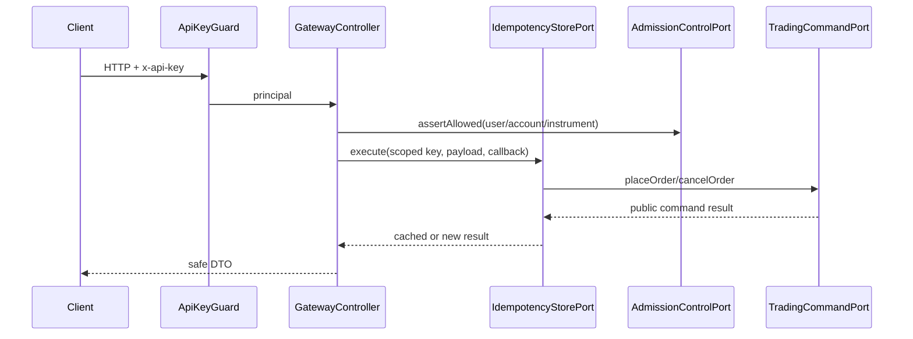

# Gateway

Gateway выполняет API-key authentication, object authorization, strict DTO
validation, rate limit и idempotent mapping HTTP-команд в trading port. Transport
не получает прямого доступа к matching engine или ledger aggregate.

## Роль в системе

Gateway — это внешний HTTP boundary биржи. Он принимает запрос от клиента,
превращает его в безопасную application command и передаёт дальше только через
порты. Модуль не принимает решений о matching, settlement, ledger postings или
projection storage. Его задача — не дать внешнему клиенту обойти security,
validation, idempotency, admission control и публичные контракты.

Gateway отвечает за:

- проверку API key и построение `ApiKeyPrincipal`;
- object-level authorization: trader работает только со своими account/order;
- strict DTO validation и отбрасывание неизвестных полей;
- rate limit на principal/key boundary;
- idempotency write-команд через `IdempotencyStorePort`;
- mapping HTTP DTO → `GatewayPlaceOrderCommand`/`GatewayCancelOrderCommand`;
- вызов `TradingCommandPort`, который скрывает in-memory или PostgreSQL command adapter;
- безопасные HTTP responses без ledger, order-book и internal aggregate state;
- Swagger metadata для публичного REST API.

Gateway не отвечает за:

- matching engine и price-time priority;
- изменение балансов и posting set;
- projection rebuild и query storage;
- WebSocket fan-out;
- durable audit chain, кроме вызова audit port в auth/admin credential flow;
- бизнес-решения admin/risk beyond вызова admission-control port.

## Как проходит command flow

Размещение заявки проходит одинаковую последовательность:

1. Combined guard проверяет scoped `x-api-key` либо live human Redis session и
   кладёт единый authorization principal в request.
2. Controller проверяет `Idempotency-Key`; ключ scope-ится через `principal.keyId`.
3. `RateLimitService` ограничивает нагрузку на authenticated boundary.
4. `ZodValidationPipe` валидирует body по allow-list schema.
5. `assertObjectAccess` запрещает trader-у работать с чужим `accountId`.
6. `AdmissionControlPort` проверяет freeze, instrument pause и circuit breaker.
7. Controller собирает `GatewayPlaceOrderCommand` или `GatewayCancelOrderCommand`.
8. `IdempotencyStorePort.execute` выполняет callback один раз для совместимого payload.
9. `TradingCommandPort` принимает команду: в component runtime это memory adapter,
   в durable runtime — PostgreSQL command journal + sequencer/outbox adapter.
10. Controller возвращает только публичный command result.

Cancel flow такой же, но source DTO содержит `orderId`, а trading port получает
`GatewayCancelOrderCommand`.

## Auth/API-key flow

Machine authentication изолирована под `/api/v1/machine-auth`: `me`, issue,
list, rotate и revoke API keys. Human password/Redis session endpoints находятся
в модуле `identity` под `/api/v1/auth` и не переиспользуют machine credential.

При issue/rotate secret возвращается только один раз. Registry хранит digest,
а публичные list/revoke responses содержат только metadata. Write endpoints
используют idempotency marker и audit port. Повтор не выпускает второй key и не
возвращает прежний secret из `public_result`.

## Взаимодействие с другими модулями

- `audit` — получает события lifecycle API keys через `AUDIT_LOG_PORT`;
- `admin/admission-control` — даёт shared freeze/pause/circuit-breaker contract;
- `trading/sequencer` — используется PostgreSQL command adapter для ownership/sequence;
- `observability` — получает stable log events, metrics и spans без payload secrets;
- `ledger`, `projections`, `instruments`, `market-data`, `admin` — импортируют
  Gateway через `../gateway` только для guard/DTO/ports, не через deep imports.

## Структура модуля

- `controllers/` — REST transport boundary для command API и auth/API-key lifecycle;
- `dto/` — публичные Swagger DTO без внутренних domain entities;
- `validation/` — Zod schemas и shared validation pipe;
- `auth/` — API-key registry, guard и authorization helpers;
- `ports/` — idempotency DI token и shared command contracts;
- `types/` — gateway command/result types и `TradingCommandPort`;
- `application/` — reference idempotency store и rate-limit policy;
- `infrastructure/` — PostgreSQL adapters для idempotency и durable command journal;
- `gateway.module.ts` — composition root transport/application adapters;
- `index.ts` — публичная точка импорта для соседних модулей.

Соседние модули импортируют Gateway только через `../gateway`. Исключение:
сам `GatewayModule` использует отдельный `../admin/admission-control` sub-boundary,
чтобы не подтягивать полный `AdminModule` и не создавать циклический Nest import.

## Контракты и инварианты

- Decimal values в HTTP передаются строками, не числами.
- Неизвестные поля в body отклоняются validation schema.
- `userId` никогда не берётся из body place/cancel; он приходит из principal.
- Один `Idempotency-Key` нельзя повторить с другим payload.
- Ошибка до durable commit не сохраняется как successful idempotency result.
- Production-like runtime не должен использовать in-memory command/idempotency adapters.
- API keys, Authorization headers, cookies и financial payload не логируются.
- Controller не импортирует matching engine, ledger aggregate или PostgreSQL client напрямую.

## Failure semantics

- Неверный API key → `401 AUTH_INVALID_API_KEY`.
- Чужой account/order → `403 AUTH_OBJECT_FORBIDDEN`.
- Повтор idempotency key с другим body → `409 IDEMPOTENCY_KEY_REUSED`.
- Отсутствующий idempotency header на write → `400 IDEMPOTENCY_KEY_REQUIRED`.
- Rate limit → `429 RATE_LIMIT_EXCEEDED`.
- Freeze/pause/circuit breaker → стабильный безопасный public rejection code.
- Internal dependency failure не раскрывает stack trace и связывается через correlationId.

## Operational log events

`gateway.command.accepted` пишется внутри idempotency callback после успешного
вызова application port; `gateway.command.rejected` — при отказе port. Все auth,
validation и pagination запросы дополнительно покрыты глобальными
`http.request.completed`/`http.request.rejected`. Headers, API keys и DTO payload
в metadata не передаются. Полный контракт: [docs/gateway.md](../../../../../docs/gateway.md).
