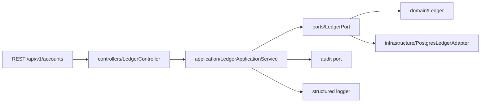

# Ledger module

## Observability boundary

Atomic posting set измеряется span `ledger.commit`. В trace и metrics запрещены
amount, accountId и posting payload; correctness контролируется settlement result
и reconciliation difference, а не раскрытием финансовых данных.

## Назначение

Доменное ядро точных денежных операций и два adapter: in-memory для
unit/component tests и `PostgresLedgerAdapter` для production-like runtime.
PostgreSQL реализация транзакционно хранит accounts, balances, reservations,
double-entry postings, operations, idempotent results и compensation links.

## Границы

Domain classes не зависят от NestJS, HTTP, БД, broker и системных часов.
Application layer использует `LEDGER_PORT`; конкретный PostgreSQL client
изолирован в infrastructure adapter и выбирается composition root.

## Структура файлов

Ledger намеренно разложен по семантическим папкам, чтобы при поддержке было
видно, какой слой меняется и какие зависимости допустимы:

- `controllers/` — REST transport boundary. Контроллер проверяет API key,
  object-level access, `Idempotency-Key`, rate limit и DTO, но не меняет баланс
  напрямую.
- `dto/` — публичные HTTP DTO и runtime validation schemas. Decimal values
  принимаются и возвращаются только строками.
- `application/` — сценарии use-case уровня: создать account, прочитать balance,
  выполнить admin balance command, записать audit и structured log outcome.
- `ports/` — стабильный `LedgerPort`, через который application слой работает с
  ledger без знания о памяти или PostgreSQL.
- `domain/` — чистые value objects и aggregate: `Asset`, `Account`, `Balance`,
  `Posting`, `Ledger`. Здесь запрещены NestJS, HTTP, SQL и mutable transport DTO.
- `infrastructure/` — PostgreSQL adapter, migrations, schema docs и integration
  tests durable write path.
- `infrastructure/repositories/` — SQL boundaries ledger tables: assets,
  accounts, balances, operations, postings и reservations. Adapter передаёт им
  transaction client и сохраняет orchestration/idempotency flow у себя.
- `index.ts` — единственный публичный barrel модуля. Соседние модули импортируют
  ledger через `../ledger`, а не через deep imports в подпапки.

## Как части взаимодействуют

Основной write-flow выглядит так:

1. `LedgerController` принимает HTTP-запрос и проверяет authentication,
   authorization, idempotency header и transport validation.
2. `LedgerApplicationService` превращает строки в typed IDs/`Decimal`, выбирает
   доменную команду и фиксирует audit/log outcome.
3. `LedgerPort` скрывает storage decision. В unit/component tests используется
   in-memory `Ledger`; в production-like runtime — `PostgresLedgerAdapter`.
4. Domain layer применяет денежные инварианты: неотрицательный available,
   корректный reserved, balanced postings и идемпотентность `operationId`.
5. Infrastructure adapter фиксирует результат транзакционно и возвращает
   публичный snapshot без внутренних domain entities.

## Публичный контракт

- `Asset` и `Account` — неизменяемые definitions;
- `Decimal` — точная арифметика на `bigint`;
- `Balance` — операции `credit`, `debit`, `reserve`, `release`, `debitReserved`;
- `Ledger` — регистрация definitions, transfer, debit/credit, reserve/release и compensation;
- `Posting` и `assertBalancedPostings` — double-entry журнал;
- `IdempotencyRecord` — связь operation ID с уже применённым результатом.

Схема PostgreSQL и retention policy описаны в [`infrastructure/schema.md`](infrastructure/schema.md), migration up/down находятся в `infrastructure/migrations/`, а решение о double-entry зафиксировано в [ADR 0003](../../../../../docs/adr/0003-double-entry-ledger.md).

## Инварианты

- available и reserved неотрицательны;
- reserved не может превышать общий доступный остаток;
- каждая операция с проводками сбалансирована по asset;
- повторный `operationId` не создаёт новый бизнес-эффект;
- compensation добавляет обратные postings и сохраняет оригинал;
- decimal arithmetic и half-up rounding не используют floating point.

## Ошибки и запуск

Некорректные IDs, assets, счета, отрицательные суммы, overdraft и несбалансированные postings отклоняются с typed domain errors в следующем этапе; сейчас используются безопасные сообщения `Error`. Тесты запускаются командой `pnpm --filter @exchange/backend test`.

## REST application boundary

- `POST /api/v1/accounts` создаёт принадлежащий authenticated principal аккаунт
  и нулевые balances;
- `GET /api/v1/accounts/{accountId}` возвращает account metadata только владельцу;
- `GET /api/v1/accounts/{accountId}/balances` и endpoint конкретного asset
  возвращают available/reserved как decimal strings;
- `POST /api/v1/accounts/{accountId}/balances/{assetId}/commands` выполняет
  admin-only `CREDIT`, `DEBIT`, `RESERVE` или `RELEASE`.

Последний endpoint не предоставляет прямого доступа к `Ledger`: DTO проходит
strict runtime validation, затем application service создаёт typed IDs и
`Decimal`, вызывает domain policy и записывает audit event. Каждый write требует
`Idempotency-Key`; повтор не создаёт вторую проводку.

Публичные DTO examples и ownership matrix находятся в
[`docs/api-client-guide.md`](../../../../../docs/api-client-guide.md), реестр routes —
в [`docs/openapi/application.yaml`](../../../../../docs/openapi/application.yaml).

## Operational log events

`ledger.command.applied` пишется после атомарного изменения состояния;
`ledger.command.rejected` — при нарушении инварианта. Amount, account owner,
баланс и postings не логируются; расследование использует command ID и audit.

## Durable transaction

Operation ID сериализует конкурентные retries. Balance mutation, две postings,
operation result и reservation/compensation link входят в один commit. Deferred
database trigger проверяет баланс debit/credit, а immutable trigger запрещает
перезапись проводок. Подробный алгоритм и запуск PostgreSQL suite описаны в
[`docs/durable-runtime.md`](../../../../../docs/durable-runtime.md).
