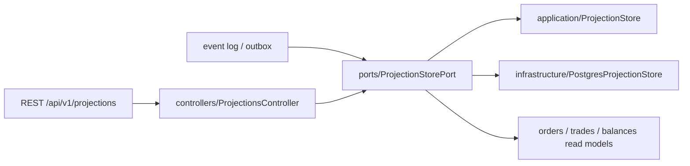

# Projections и query API

## Структура файлов

Модуль разделён по ролям, чтобы query API, consumer logic и storage не
смешивались в одном файле:

- `controllers/` — REST query boundary. Controller берёт `userId` только из
  authenticated principal и не принимает owner/account identifiers из query как
  источник полномочий.
- `dto/` — публичные Swagger DTO response pages и lag metrics.
- `types/` — read-model contracts: `ProjectionEvent`, `OrderView`, `TradeView`,
  `BalanceView`, `ProjectionPage` и `ProjectionMetrics`.
- `ports/` — `ProjectionStorePort`, общий application/infrastructure boundary
  для apply/rebuild/query operations.
- `application/` — reference in-memory `ProjectionStore`, который реализует
  ordering, duplicate detection, rebuild и cursor policy для unit/component
  тестов и development fallback.
- `infrastructure/` — `PostgresProjectionStore`, где event ID, read-model
  mutation и projection offset фиксируются одной transaction.
- `infrastructure/repositories/` — SQL boundaries конкретных projection tables:
  versions, processed events, orders, trades и balances. Store передаёт им
  transaction client, но repositories не открывают transaction сами.
- `index.ts` — публичный barrel. Остальные модули импортируют projections через
  `../projections`, а не через deep imports во внутренние папки.

## Как части взаимодействуют

Write-side consumer применяет события через `ProjectionStorePort.apply`.
Read-side transport использует тот же port для owner-isolated queries. Поэтому
контроллер не знает, где лежат таблицы/карты, и не может обойти pagination,
versioning или authorization-filtering.

## Durable adapter и rebuild

Production composition использует `PostgresProjectionStore`. Event ID,
read-model mutation и applied sequence фиксируются одной transaction. Query
всегда фильтруется по authenticated owner и ACTIVE projection version.

Rebuild пишет в новую BUILDING version и атомарно переключает version pointer;
частично построенные rows недоступны API. Старую RETIRED version удаляют только
после reconciliation и retention boundary.

## Observability boundary

`projection.apply` продолжает trace исходного event, projection lag публикуется
bounded gauge, а sequence gap — отдельным counter. User/account IDs не являются
labels и применяются только внутри authorization-filtered read model.

Projection store строит order history, trade history и balance read models из упорядоченного event log. `eventId` защищает от duplicate delivery, `sequence` обнаруживает gap, а `rebuild(events)` очищает состояние и выполняет полный replay.

Query endpoints:

- `GET /api/v1/projections/orders?limit=50&cursor=...`;
- `GET /api/v1/projections/trades?limit=50&cursor=...`;
- `GET /api/v1/projections/balances?limit=50&cursor=...`;
- `GET /api/v1/projections/metrics`.

Все endpoints используют Gateway API key и фильтруют данные по `principal.userId` до cursor pagination. Запрос не может указать чужой user/account ID.

Все публичные интерфейсы и методы имеют подробные русские JSDoc-комментарии.

Каждый endpoint описан отдельным Swagger response DTO. Query parameters
`limit/cursor`, ошибки pagination, API-key security и decimal-string поля входят
в generated OpenAPI. DTO содержат только read-model snapshots и не экспортируют
`ProjectionStore` либо внутренние event payload.

Версионируемый реестр routes и клиентские правила: [OpenAPI](../../../../../docs/openapi/application.yaml)
и [client guide](../../../../../docs/api-client-guide.md).

## Operational log events

`projection.applied`, `projection.duplicate`, `projection.rebuilt` и
`projection.gap` описывают consumer state. Duplicate имеет outcome `recovered` и
не считается вторым business-success. Event payload/read model не сериализуются.
