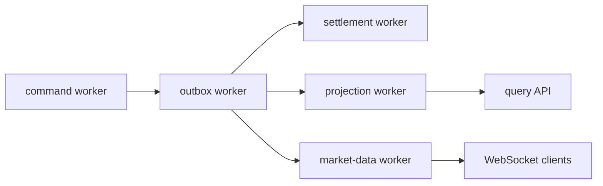

# Trading durable workers

Модуль `trading/workers` отвечает за эксплуатационный жизненный цикл фоновых
consumers торгового контура. Он не содержит бизнес-правил matching, settlement
или projection — вместо этого он управляет тем, как эти consumers запускаются,
останавливаются, повторяют batch, фиксируют lag и участвуют в readiness.

## Зачем это нужно

Публичная команда биржи не должна зависеть от ручного вызова сервисов. После
durable acceptance runtime должен сам довести работу до terminal состояния:

`DurableWorkerManager` даёт всем workers одинаковые safety-свойства:

- bounded `batchSize`, `concurrency` и `timeoutMs`;
- bounded retry с exponential backoff и jitter;
- DLQ/quarantine через concrete worker/event-log adapter;
- lag metric `exchange_consumer_lag_events`;
- graceful shutdown через `DRAINING`;
- readiness failure, если processing нельзя безопасно продолжать;
- operator replay quarantined event без изменения исходной DLQ записи.

## Роли workers

| Worker | Роль |
| --- | --- |
| `command` | читает durable command journal и запускает application processor после recovery |
| `outbox` | публикует committed events во внешний transport/fan-out |
| `settlement` | применяет settlement effects идемпотентно после `TradeExecuted` |
| `projection` | применяет events к read-model и фиксирует offset после mutation commit |
| `market-data` | публикует public/private messages из committed domain events |

## Offset и commit

Worker не должен двигать offset до business commit. Если процесс падает между
чтением события и commit, следующий запуск видит тот же offset и повторяет
обработку. Повторный business effect подавляется eventId/operationId/idempotency
на стороне конкретного consumer-а.

## Recovery и readiness

Перед открытием нормальной обработки manager вызывает `recover()` каждого
worker-а. Production worker должен восстановить lease/snapshot/high watermark и
только после этого перейти в `RUNNING`.

Readiness вызывает `checkReady()` и возвращает `503`, если критичный worker
находится не в `RUNNING`/`DRAINING` или не может безопасно провериться. Отказ
observability backend не участвует в этой проверке.

## Operator replay

`replayQuarantined(worker, eventId, operatorId)` создаёт новое replay-событие
через concrete adapter. Исходная DLQ запись остаётся immutable: меняются только
operator metadata и ссылка на replay.

## Текущий production gap

Managed lifecycle уже подключён к composition root. Следующий обязательный шаг
для полного production gate — заменить общий `EventLogPort` на named durable
consumer adapters с независимыми offsets для `command`, `outbox`, `settlement`,
`projection` и `market-data`. Без этого нельзя считать пять consumers полностью
изолированными на PostgreSQL/Kafka уровне.
