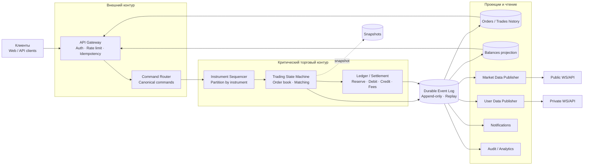
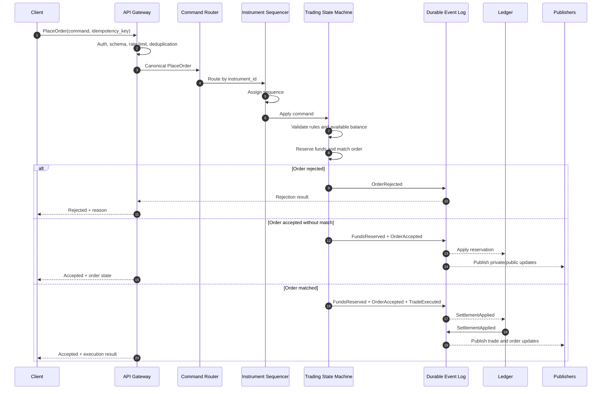
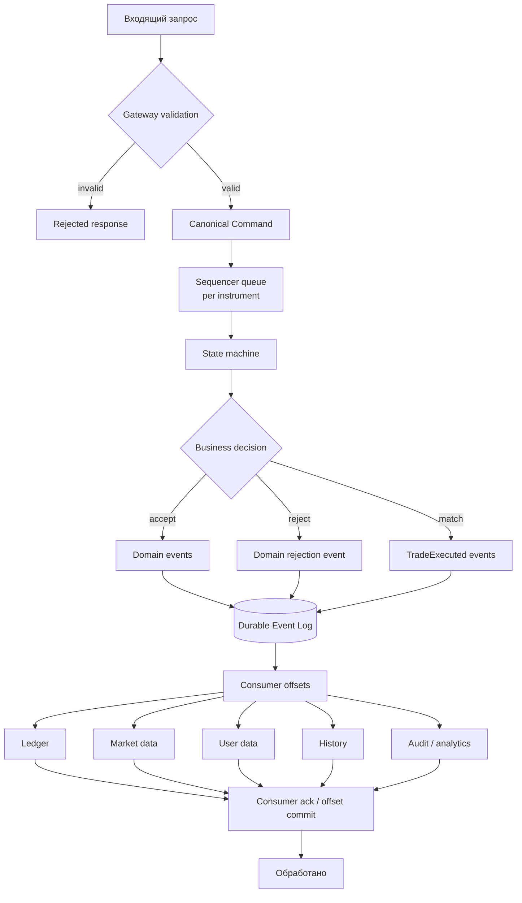
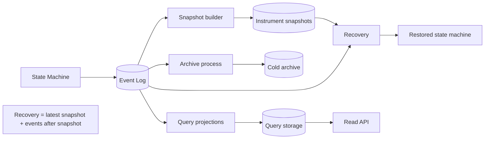
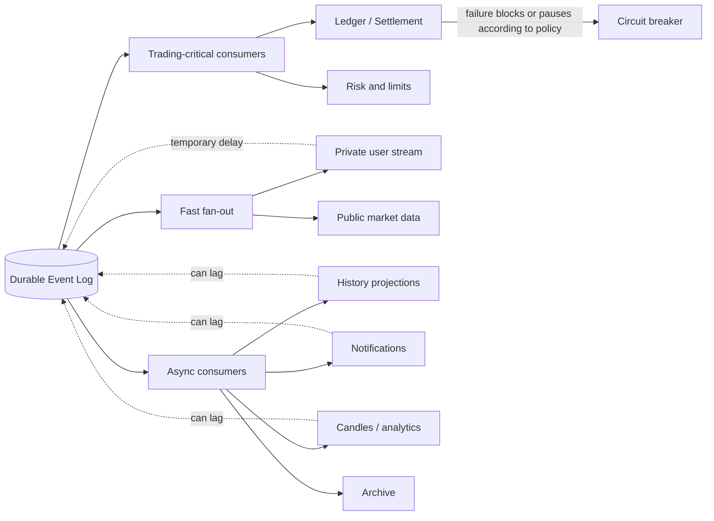

# Архитектура биржи: компоненты и потоки

Статус: draft 0.1  
Область: тренировочная spot-биржа, matching без custody, внутренние балансы.

## 1. Главный принцип

Система разделяет:

- **команду** — намерение выполнить действие (`PlaceOrder`, `CancelOrder`);
- **событие** — подтверждённый факт (`OrderAccepted`, `TradeExecuted`, `OrderCancelled`);
- **состояние** — результат применения последовательности событий (стакан, баланс, состояние ордера).

Команда приходит извне и может быть отклонена. Событие не просит выполнить действие — оно сообщает, что действие уже принято системой. Это различие необходимо для аудита, повторного проигрывания и независимой работы downstream-сервисов.

## 2. Логическая схема компонентов

```text
Clients
   |
   v
API Gateway / Session Gateway
   |
   v
Command Router / Admission
   |
   v
Instrument Sequencer + Matching State Machine
   |                         |
   |                         +--> Order/Trade events
   v
Durable Event Log ---------- + ------------------------------+
   |                         |                              |
   v                         v                              v
Ledger / Settlement     Market Data Publisher          User Data Publisher
   |                         |                              |
   v                         v                              v
Balance projections      Public WS/API                  Private WS/API

Event Log consumers: history, notifications, audit, metrics, analytics, reconciliation
Query projections: orders, trades, balances, instruments, candles
Admin/Risk ---> control plane ---> Gateway / Sequencer / Instruments
```

Физическое разбиение на deployable-сервисы не обязано повторять логическое. На первом этапе Gateway, Router, state machine и event log могут запускаться компактно, но границы доменов должны оставаться явными.

## 3. Компоненты

### 3.1. API Gateway / Session Gateway

Отвечает за:

- REST/WebSocket подключения;
- аутентификацию, API keys, MFA/session policy;
- проверку схемы, размера запроса и формата чисел;
- rate limiting, quotas и защиту от replay;
- correlation ID и idempotency key;
- маршрутизацию по инструменту/команде;
- публикацию ответов и подписку на private/public streams.

Gateway не должен владеть стаканом, балансом или окончательным порядком заявок. Он может быстро отклонить явно некорректный запрос, но бизнес-валидация и резервирование средств выполняются внутри последовательного торгового контура.

### 3.2. Command Router / Admission

Преобразует внешний запрос в каноническую команду, проверяет базовые права и направляет её владельцу конкретного инструмента.

Пример команд:

- `PlaceOrder`;
- `CancelOrder`;
- `CreateAccount`;
- `DepositInternalBalance` — только административная/учебная команда.

Для каждой команды сохраняются `command_id`, `idempotency_key`, `user_id`, `api_key_id`, `received_at`, `instrument_id`, `request_version` и исходные параметры.

### 3.3. Instrument Sequencer

У каждого стакана есть один логический последовательный владелец. Он:

- присваивает командам последовательный `sequence`;
- гарантирует порядок обработки;
- исключает гонки между несколькими API-инстансами;
- передаёт команды state machine;
- фиксирует результат в durable log.

Партиционирование выполняется по `instrument_id`. Команды одного инструмента идут последовательно; разные инструменты могут обрабатываться параллельно.

### 3.4. Trading State Machine

Детерминированно применяет команду к состоянию инструмента и создаёт события.

Состояние включает:

- активные заявки и очереди по ценовым уровням;
- правила инструмента: tick size, lot size, min/max order;
- торговый статус и risk limits;
- версии комиссий;
- sequence последнего обработанного события.

State machine не должна вызывать внешние медленные сервисы. Проверка доступного баланса должна использовать локально согласованное торговое состояние или синхронный локальный ledger-контур, но не HTTP-вызов к удалённому провайдеру.

### 3.5. Ledger / Settlement

Применяет результаты сделки и операции резервирования к двойной бухгалтерской модели:

- available balance;
- reserved balance;
- executed/debited/credited accounts;
- fee account;
- технические clearing accounts.

Ledger не изменяет историю задним числом. Исправление выполняется компенсирующей проводкой.

Для учебного MVP ledger может быть частью торгового процесса по логическому контракту `TradeExecuted -> SettlementApplied`, но его модель должна быть отдельным доменом. Это оставляет путь к отдельному клирингу в будущем.

### 3.6. Event Log

Долговечный упорядоченный журнал команд и событий. Это транспорт и источник для replay, а не пользовательская read-модель.

Требования:

- append-only;
- partition по инструменту для trading events;
- sequence number внутри partition;
- durable acknowledgement до ответа «команда принята»;
- retention policy;
- snapshot/replay;
- повторное чтение событий независимыми consumer-группами;
- обнаружение gaps и контроль схемы событий.

### 3.7. Проекции и read-модели

Отдельные проекции строятся потребителями event log:

- текущие заявки пользователя;
- история ордеров и сделок;
- балансы;
- публичный стакан и ticker;
- свечи;
- аудит;
- аналитика.

Read-модель может отставать от торгового контура. Ответ на команду должен сообщать состояние приёма/исполнения из торгового контура, а не предполагать, что все проекции уже обновились.

## 4. Формат сообщения

Сообщение должно быть самодостаточным настолько, чтобы потребитель мог обработать его без обращения к Gateway. Но не нужно помещать в одно сообщение все данные всех сервисов.

Общий envelope:

```json
{
  "message_id": "uuid",
  "message_type": "PlaceOrder",
  "message_version": 1,
  "occurred_at": "server timestamp",
  "received_at": "server timestamp",
  "sequence": 18421,
  "partition_key": "BTC-USD",
  "correlation_id": "uuid",
  "causation_id": "uuid",
  "producer": "trading-core",
  "actor": {
    "user_id": "user-123",
    "api_key_id": "key-1"
  },
  "payload": {}
}
```

Для `PlaceOrder` payload должен содержать как минимум `order_id`, `instrument_id`, `side`, `order_type`, `quantity`, `limit_price` при необходимости, `time_in_force`, `client_order_id`, `fee_policy_version` и `risk_policy_version`.

Для событий нужно включать итоговые значения: исполненное количество, цену, комиссию, валюту комиссии, остаток, причину отказа и ссылки на связанные идентификаторы. Потребитель не должен вычислять критичные финансовые значения по неполным данным.

## 5. Потоки

### Размещение заявки

```text
Client
 -> Gateway: PlaceOrder + idempotency key
 -> Router: canonical command
 -> Sequencer(instrument): assign sequence
 -> State Machine: validate, reserve, match
 -> Event Log: accepted/rejected + executions
 -> Ledger: apply reservation/settlement
 -> Projections: history and balances
 -> Publishers: private/public updates
 -> Client: ack + order/trade events
```

Критический путь должен быть коротким и синхронным до момента надёжной фиксации результата. Уведомления, свечи, аналитика и часть истории могут обрабатываться асинхронно.

### Медленный downstream-сервис

Если сервис временно недоступен, он не должен останавливать matching без необходимости. Он читает события после восстановления с последнего подтверждённого offset. Если отсутствие сервиса нарушает денежный инвариант, его нужно считать частью критического settlement-контура и явно принять соответствующую задержку.

## 6. Как хранить события

Хранить все события только в обычной CRUD-БД действительно нецелесообразно. Но полностью отказываться от хранения нельзя: без durable log невозможно доказать порядок, восстановить state machine и расследовать операции.

Рекомендуемая модель — три слоя:

### Hot event log

Быстрая append-only запись для недавних событий и replay. Хранит команды, решения state machine и доменные события. Срок hot retention для MVP: 7–30 дней.

### Snapshots

Периодические снимки состояния каждого инструмента и ledger-проекций. Восстановление выполняется как:

```text
последний snapshot + события после snapshot = текущее состояние
```

Snapshot не заменяет журнал и не является единственным источником истины.

### Cold archive

Старые сегменты event log выгружаются в дешёвое объектное/файловое хранилище в неизменяемом формате. Для учебного проекта достаточно локального архивного формата с checksum; позже можно добавить WORM/object-lock политики.

### Query storage

Для пользовательских запросов используются отдельные проекции с индексами: «мои ордера», «история сделок», «баланс», «свечи». Клиентские чтения не должны сканировать event log.

Итого: event log нужен для истины и восстановления, snapshots — для быстрого старта, query storage — для удобного чтения. Это разные задачи и обычно разные формы хранения.

## 7. Гарантии доставки и согласованность

- Внутри event log — упорядоченная запись на partition.
- Между сервисами — at-least-once delivery.
- Каждый consumer хранит offset и обрабатывает события идемпотентно.
- Дубликаты устраняются по `message_id`, а бизнес-операции — по `command_id`/`trade_id`.
- Не следует обещать глобальный exactly-once для всей системы; достигается эффект exactly-once через durable log, идемпотентность и дедупликацию.
- Публикация ответа клиенту и обновление read-модели не должны быть основанием для повторной сделки.

## 8. Границы синхронности

### Синхронно в торговом контуре

- аутентификация и права;
- формат и базовые лимиты;
- проверка доступного/зарезервированного баланса;
- последовательность инструмента;
- matching;
- фиксация результата в durable log;
- критичные ledger-проводки.

### Асинхронно

- уведомления;
- свечи и аналитика;
- полнотекстовая история;
- отчёты;
- экспорт данных;
- архивирование;
- вторичные risk-сигналы, не блокирующие pre-trade invariant.

## 9. Решения, которые нужно принять перед реализацией

1. Будет ли ledger частью одного процесса с state machine на MVP или отдельным процессом с синхронным контрактом?
2. Считается ли `OrderAccepted` достаточным ответом, или клиент ждёт финальный результат match в том же запросе?
3. Какой срок hot retention и какой срок полного аудита?
4. Как часто делать snapshots: по числу событий, по времени или по обоим условиям?
5. Какие события доступны публично, а какие только владельцу счёта?
6. Какая политика при недоступности ledger, market-data publisher и query projections?
7. Какой формат схемы сообщений и политика обратной совместимости?

Для тренировочного MVP рекомендуется начать с одного логического trading core, встроенного ledger-контуром, durable event log и отдельными асинхронными проекциями. Сразу дробить matching на независимые микросервисы не следует: это усложнит порядок и денежные инварианты без пользы на заданной нагрузке.

## 10. Графическое представление

### 10.1. Компоненты системы



### 10.2. Критический путь размещения ордера



### 10.3. Жизненный цикл события



### 10.4. Хранение и восстановление



### 10.5. Разделение быстрых и медленных потоков



На этих схемах стрелка от `Event Log` означает независимое чтение события consumer-группой. Если один downstream-сервис задерживается, остальные продолжают обработку; исключение составляют компоненты, нарушение работы которых угрожает денежным инвариантам.
