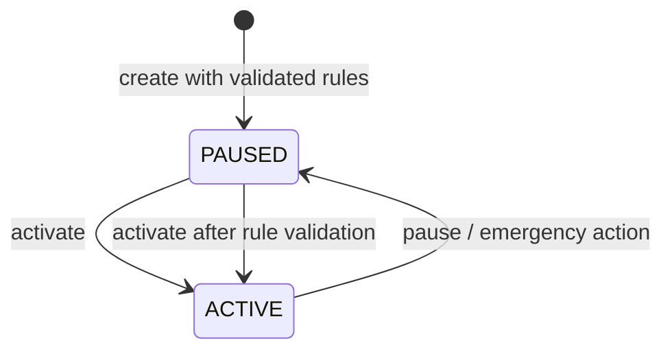

# Каталог правил инструмента

Статус: accepted  
Дата: 2026-08-31

## Поля

| Поле                              | Назначение                                  |
| --------------------------------- | ------------------------------------------- |
| `baseAssetId` / `quoteAssetId`    | активы торговой пары; не могут совпадать    |
| `tickSize`                        | минимальный шаг цены                        |
| `lotSize`                         | минимальный шаг количества                  |
| `minQuantity` / `maxQuantity`     | границы объёма одной заявки                 |
| `priceBand.min` / `priceBand.max` | допустимый диапазон limit price             |
| `feePolicyVersion`                | версия комиссии, применяемая к заявке       |
| `limits.maxOrderQuantity`         | дополнительный risk cap объёма              |
| `limits.maxOpenOrders`            | cap открытых заявок пользователя/контекста  |
| `limits.maxNotional`              | cap `quantity × limitPrice`                 |
| `version` / `effectiveAt`         | immutable версия и момент вступления в силу |

## Lifecycle

Создание всегда начинается с `PAUSED`. В `ACTIVE` инструмент переходит только после успешной проверки правил. `pause` запрещает новые заявки, но не удаляет history и не отменяет уже исполненные операции.

## Versioning policy

Новая версия добавляется с монотонным `effectiveAt`. При проверке заявки выбирается последняя версия, действующая на timestamp заявки; результат сохраняет её `version`. Уже опубликованные версии неизменяемы. Изменение base/quote, precision или смысла поля требует новой catalog migration и audit record.

## Admin audit requirements

Каждый lifecycle/rules change обязан содержать actor ID, reason, old/new status, old/new rules version, effectiveAt, correlation ID и timestamp. Запись audit append-only; секреты и credentials в ней запрещены.
