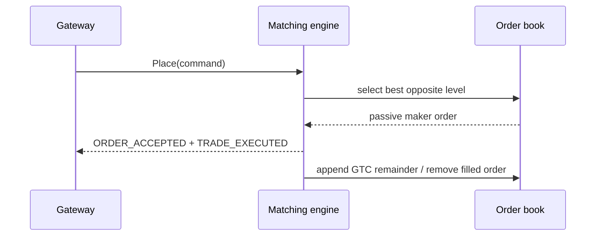
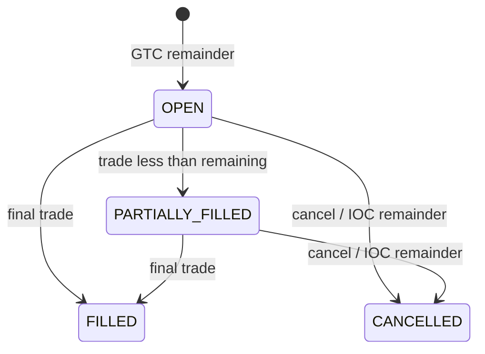

# Matching engine: state transitions and algorithm

Статус: accepted  
Дата: 2026-09-02

## State transition table

| Command             | Предусловие                | Результат                                                                          |
| ------------------- | -------------------------- | ---------------------------------------------------------------------------------- |
| Place GTC           | valid order                | accepted; остаток становится `OPEN` или `PARTIALLY_FILLED` и попадает в FIFO level |
| Place IOC           | valid order                | accepted; исполненный объём и `ORDER_CANCELLED` для остатка                        |
| Place FOK           | доступен полный объём      | atomic full fill или `FOK_NOT_FILLED` без изменений book                           |
| Place MARKET        | есть встречная ликвидность | fill по passive prices; остаток IOC-cancel                                         |
| Cancel              | order active               | `CANCELLED`, order удалён из level                                                 |
| Cancel              | order отсутствует/filled   | `ORDER_NOT_FOUND`                                                                  |
| Place crossing self | maker user = taker user    | `SELF_TRADE`, incoming order не становится active                                  |

## Algorithm

У каждого side есть `Map<price, FIFO[]>`. Для incoming BUY levels сортируются по возрастанию цены asks, для SELL — по убыванию цены bids; одинаковая цена сортируется по monotonic sequence. Matching loop вычитает min(remaining, maker remaining), создаёт trade по maker price и удаляет полностью исполненный maker.

Сложность текущей reference implementation: выбор лучшего maker — `O(n log n)` из-за сортировки всех active opposite orders, исполнение — `O(k)`. Production optimization может использовать ordered price tree, сохраняя FIFO и deterministic ordering.

## Replay и benchmark

`golden-replay.json` фиксирует базовую последовательность. Property-based replay тест прогоняет сгенерированные последовательности дважды. Benchmark выполняет 1000 локальных команд без network/DB calls и проверяет только deterministic sequence.

## Lifecycle diagram

