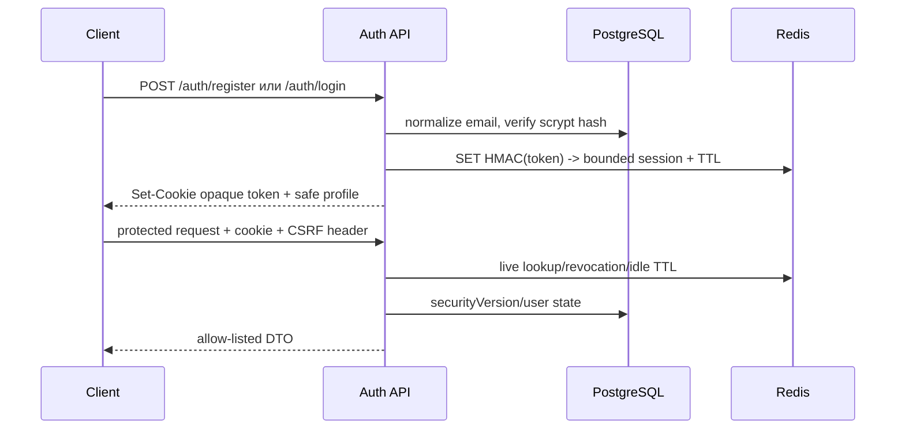

# Authentication, sessions и identity

Статус: действующий security design этапа 22.

## Границы механизмов

| Механизм | Назначение | Credential | Source of truth |
|---|---|---|---|
| Human session | браузер/пользователь | opaque cookie, HttpOnly | Redis |
| API key | machine-to-machine | `x-api-key`, показывается один раз | digest + metadata |
| Test bypass | isolated product tests | `X-Test-Auth-Token` | secret env + fixed identity |

Human token не является API key. Test header не принимает `userId`, role или
accountId: они приходят только из `AUTH_TEST_IDENTITY`. Bypass допустим одновременно
только при `NODE_ENV=test`, `RUNTIME_PROFILE=component` и
`AUTH_TEST_BYPASS_ENABLED=true`; любое применение пишет `auth.test-bypass.used`.

## Flows

Login и register создают новый `sessionId`, поэтому fixation невозможна. Password
change повышает `securityVersion`, отзывает sessions согласно выбранной policy и
выдаёт новый token. Logout сохраняет revoked metadata до absolute expiry.

Recovery request всегда возвращает `{ "accepted": true }`. Для существующего
email создаётся random token, PostgreSQL хранит только HMAC digest, а raw token
однократно передаётся подписанному HTTPS mail boundary. Consume атомарно ставит
`consumed_at`; повтор и expired token получают один public error.

## Session schema и TTL

Record содержит `sessionId`, `userId`, roles/scopes snapshot, auth level,
`createdAt`, `lastSeenAt`, idle `expiresAt`, `absoluteExpiresAt`, `revokedAt`,
`securityVersion`, digest device/IP metadata и correlation metadata. Размер
ограничен `AUTH_SESSION_MAX_VALUE_BYTES` (по умолчанию 8 KiB).

Redis keys: `<namespace>:token:<HMAC>` для lookup,
`<namespace>:session:<HMAC(sessionId)>` и `<namespace>:user:<HMAC(userId)>`.
Raw token, email и accountId в key/value отсутствуют. Sliding refresh не выходит
за absolute TTL; `AUTH_MAX_SESSIONS_PER_USER` отзывает самые старые sessions.

## Redis operations и degraded mode

Deployment использует отдельного ACL user с командами `GET`, `SET`, `MGET`,
`SADD`, `SMEMBERS`, `EXPIRE`, `PING`, `MULTI`, `EXEC` и namespace key pattern.
Запрещены `KEYS`, `FLUSH*`, `CONFIG`, `EVAL`, admin/pubsub commands. Production
URL обязан быть `rediss://` с AUTH; TLS certificate проверяется клиентом.

Redis outage не влияет на `/health/live`, но `redis-sessions` переводит readiness
в `unavailable`; auth-dependent admission отвечает `503
AUTH_SESSION_STORE_UNAVAILABLE`. Offline queue отключена, connect timeout bounded,
reconnect имеет максимум пять попыток с bounded exponential backoff. Нельзя
fallback-нуться на memory или считать локальный cache источником истины.

Runbook: проверить TLS/ACL и latency, остановить admission при 503, не перезапускать
все replicas одновременно, восстановить Redis из durable topology, проверить
точечный revoke и login canary, затем вернуть traffic. Liveness не использовать
для диагностики Redis.

## Endpoints

- `POST /api/v1/auth/register`, `login`, `logout`, `logout-all`; `GET /auth/me`;
- email verification и password reset request/confirm;
- `PATCH /api/v1/users/me`, `POST /users/me/password`;
- `GET /users/me/sessions`, `DELETE /users/me/sessions/{sessionId}`;
- admin list/revoke/revoke-all/require-password-reset под
  `/api/v1/admin/users/{userId}` с reason и `Idempotency-Key`;
- API keys под `/api/v1/machine-auth` со scopes, owner metadata, expiry,
  rotation/revoke. Issue/rotate secret не пишется в idempotency `public_result`;
  retry сообщает, что secret уже показывался.

## Privacy, retention и аудит

Password/session/API key/recovery secrets запрещены в responses, logs, metrics,
traces, projections, audit details и artifacts. Email, name, IP и User-Agent —
PII: IP/UA сохраняются только как keyed digest и не используются metric labels.
Challenge rows очищаются после 30 дней, revoked session metadata — после absolute
TTL, user/security audit — по общей семилетней политике. User registration,
login/logout, password/profile changes и revoke создают security/audit events;
test bypass не маскируется под пользовательский audit event.

## Threat model и ручная проверка

- Hijacking/XSS: HttpOnly+Secure+SameSite, short idle TTL, point revoke.
- Fixation/stale privilege: новый ID при auth/password change + securityVersion.
- CSRF: derived double-submit token для unsafe cookie requests; Bearer не смешивается.
- Credential stuffing/enumeration: отдельный rate limit, dummy scrypt, стабильные errors.
- Replay: one-time consumed challenges, bounded expiry, API-key secret shown once.
- Redis compromise: HMAC token lookup/keys, no raw credentials, TLS/ACL/minimal commands.
- Insider/admin abuse: role/object checks, mandatory reason/idempotency and immutable audit.

Risk model относит session revoke и принудительный recovery к восстановительным,
полностью аудируемым действиям: для них достаточно single-control ADMIN. Freeze,
unfreeze и изменения финансовых/risk policies остаются в существующем
dual-control контуре `admin` и требуют независимого approver.

Ручной canary: register → me → second login → list sessions → revoke first → first
cookie получает 401 → password change → old cookies получают 401 → logout-all.
Проверить, что ответы/логи не содержат canary password, cookie, API key, reset token
или Redis URL; затем остановить Redis и убедиться в `ready=503`, `live=200`.
