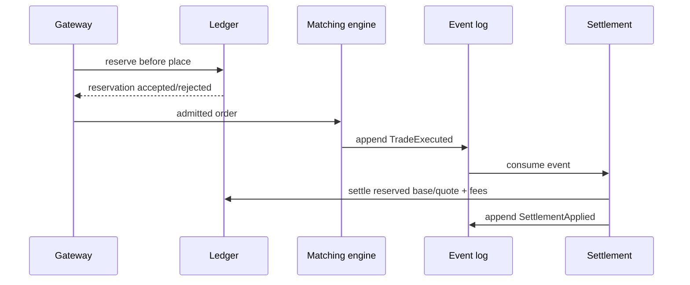

# Settlement flow

Статус: accepted  
Дата: 2026-09-04

## Event log policy

Event log append is treated as durable before consumer processing. Consumer commits offset only after handler success; crash before commit causes redelivery. Settlement uses `tradeId` idempotency, so redelivery has exactly-once business effect. Transient append failures retry up to configured limit; permanent poison events go to DLQ with event ID, error code and correlation metadata, without secrets or full payload logging.

Retention: `TradeExecuted` and `SettlementApplied` должны храниться не меньше срока rebuild/reconciliation и финансового audit retention. Archive/delete policy является отдельным operational decision и не удаляет ledger postings.

## Reconciliation and incident response

Периодически сверяются: каждый `TradeExecuted` имеет один `SettlementApplied`, все referenced posting IDs существуют, postings balanced per asset, а duplicate event не увеличивает posting count. При расхождении остановить consumer partition, сохранить event ID/trade ID/correlation ID, replay-ить из последнего snapshot и выполнить ledger reconciliation. Ручное исправление выполняется только compensation operation.
