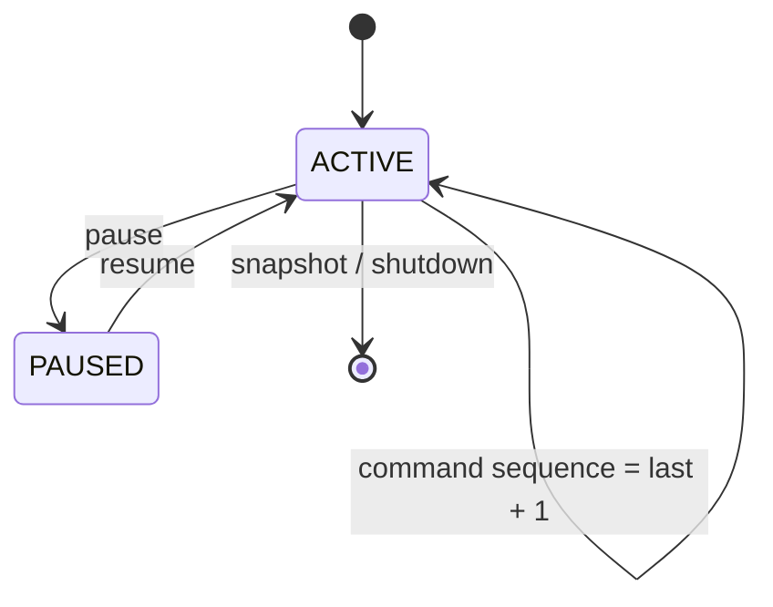
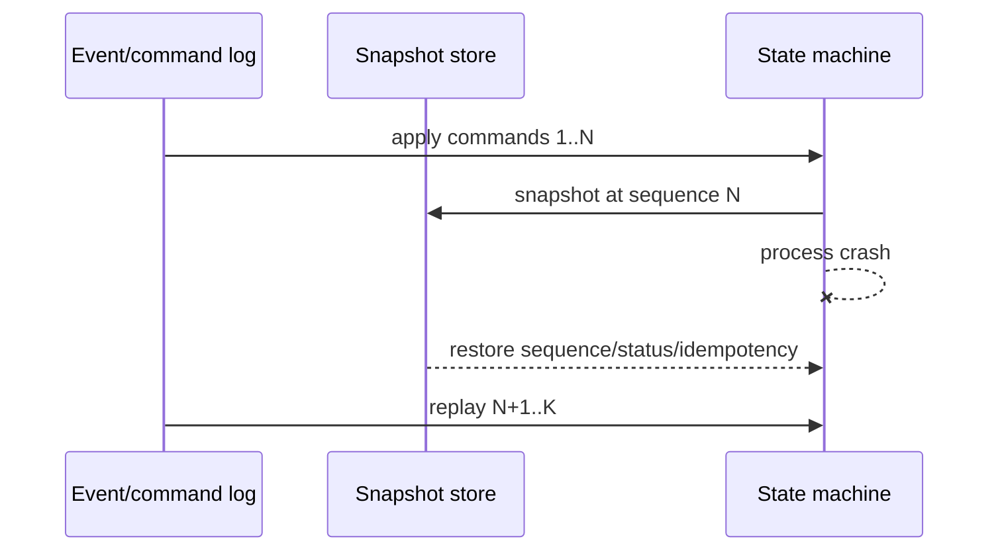

# Sequencer и trading state machine

Статус: accepted  
Дата: 2026-09-03

## Ordering model

`instrumentId` является partition key. Только назначенный owner может отправлять команды этой partition. Sequence начинается с 1 и увеличивается строго на единицу; gap и sequence меньше 1 отклоняются до transition. Разные инструменты имеют независимые sequence и могут обрабатываться параллельно.

## Admission and deduplication

Проверки выполняются в порядке owner → partition → pause → duplicate → sequence. Duplicate `commandId` возвращает ранее сохранённый result даже после restore snapshot. Новый transition записывается только после успешного выполнения handler.

## Snapshot/replay flow

## Latency budget и backpressure

Для критического пути admission + transition целевой бюджет — до 1 ms p95 внутри процесса и до 5 ms p99 без внешних вызовов. Sequencer не должен неограниченно накапливать команды: transport adapter обязан ограничивать queue depth, отклонять новые команды с `BACKPRESSURE` и экспортировать queue depth/lag metrics. Эти transport limits будут добавлены вместе с durable event log.
