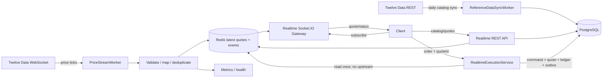

# План интеграции Twelve Data

Статус: proposal 0.1  
Дата проверки внешней документации: 2026-09-27  
Область: отдельный realtime-контур котировок и учебного исполнения без изменения текущего matching flow.

Статус реализации на 2026-09-28: этапы 1–5 реализованы. Provider ingest и
reference-price execution имеют независимые feature flags; execution и kill
switch по умолчанию выключены.

## 1. Целевое решение

Текущий `POST /api/v1/orders` и namespace `/market-data` остаются без изменений:
заявки продолжают попадать во внутренний matching engine и исполняться друг
против друга. Для Twelve Data создаётся отдельный bounded context
`realtime-market`:

1. Один ingest-worker получает разрешённый каталог через REST и тики через
   upstream WebSocket.
2. Нормализованные последние цены сохраняются в общем Redis cache и раздаются
   пользователям через наши REST/Socket.IO endpoints.
3. `POST /api/v1/realtime/orders` выполняет отдельную учебную операцию по свежей
   цене из cache.
4. До изменения балансов использованная котировка и её происхождение атомарно
   сохраняются вместе с settlement в PostgreSQL.
5. В пользовательском request path вызовов Twelve Data нет.

### Продуктовое ограничение

Twelve Data — источник market data, не брокер и не execution venue. Его last
price не гарантирует возможность купить или продать заданный объём. Upstream
WebSocket сейчас не предоставляет bid/ask. Поэтому новый контур является
**reference-price execution / симуляцией**, а не реальным рыночным исполнением.

Для MVP рекомендуется явная политика `EXACT_LAST`:

- `executionPrice = referencePrice` последнего свежего тика;
- одна цена применяется для BUY и SELL, скрытый spread не добавляется;
- сохраняются `priceSource=TwelveData`, `priceType=LAST`, provider timestamp,
  local receive timestamp и `quoteId`;
- устаревшая/отсутствующая цена приводит к отказу, без fallback в matching;
- реальное исполнение, bid/ask и гарантии ликвидности потребуют отдельного
  broker/exchange execution API.

Учебный settlement выполняется против заранее профинансированного системного
liquidity account. Автоматический mint/burn в торговой операции запрещён. При
недостатке его средств возвращается `LIQUIDITY_UNAVAILABLE`.

## 2. Изоляция от текущего flow

| Область | Текущий контур | Новый контур |
| --- | --- | --- |
| Инструменты | `GET /api/v1/instruments` | `GET /api/v1/realtime/instruments` |
| Заявки | `POST /api/v1/orders` | `POST /api/v1/realtime/orders` |
| История | `/api/v1/orders/**` | `/api/v1/realtime/orders/**` |
| Market data | `/market-data` | `/realtime-market-data` |
| Цена | внутренняя книга | свежий сохранённый Twelve Data tick |
| Контрагент | другой пользователь | system liquidity account |

Новый controller не вызывает существующий `TRADING_COMMAND_PORT`. У него свой
`RealtimeExecutionPort`, command journal, projections и public error catalog.

## 3. Публичные API

```text
GET  /api/v1/realtime/instruments
GET  /api/v1/realtime/instruments/:instrumentId
GET  /api/v1/realtime/quotes?instrumentIds=...
POST /api/v1/realtime/orders
GET  /api/v1/realtime/orders
GET  /api/v1/realtime/orders/:orderId
```

`GET /realtime/instruments` читает локальный versioned PostgreSQL snapshot,
имеет cursor pagination и фильтры `assetClass`, `exchange`, `status`, `query`.
Пользовательский запрос никогда не проксируется в Twelve Data.

Пример инструмента:

```json
{
  "id": "td:crypto:coinbase:BTC-USD",
  "displaySymbol": "BTC/USD",
  "providerSymbol": "BTC/USD",
  "assetClass": "CRYPTO",
  "exchange": "Coinbase",
  "baseAssetId": "BTC",
  "quoteAssetId": "USD",
  "priceEnabled": true,
  "tradeEnabled": true,
  "status": "ACTIVE",
  "source": "TwelveData"
}
```

Публичный ID включает venue там, где symbol неоднозначен. Нельзя автоматически
свести все варианты `BTC/USD` к существующему `BTC-USD`: mapping создаётся явно
и проходит admin approval.

Пример quote:

```json
{
  "instrumentId": "td:crypto:coinbase:BTC-USD",
  "quoteId": "q_...",
  "price": "63842.17",
  "priceType": "LAST",
  "providerTimestamp": "2026-09-27T10:15:31.000Z",
  "receivedAt": "2026-09-27T10:15:31.118Z",
  "expiresAt": "2026-09-27T10:15:36.118Z",
  "status": "FRESH",
  "source": "TwelveData"
}
```

Decimal остаётся строкой. Нельзя подменять отсутствие цены нулём, старой ценой
без маркировки либо котировкой другого venue.

Команда MVP:

```json
{
  "commandId": "cmd-rt-1",
  "orderId": "order-rt-1",
  "accountId": "account-1",
  "instrumentId": "td:crypto:coinbase:BTC-USD",
  "side": "BUY",
  "quantity": "0.01",
  "expectedQuoteId": "q_..."
}
```

Условия контракта:

- только немедленная операция; `LIMIT`, `GTC` и cancel в MVP отсутствуют;
- обязателен существующий `Idempotency-Key`, scoped по API key;
- `expectedQuoteId` гарантирует, что пользователь подтвердил показанную цену;
- смена quote: `409 QUOTE_CHANGED` и новая публичная котировка;
- просроченный quote: `409 QUOTE_STALE`;
- ingest/cache недоступен: `503 REALTIME_PRICE_UNAVAILABLE`;
- success содержит execution price/quantity/notional/fee, provenance и `FILLED`.

Позже можно добавить `maxSlippageBps`, но строгий quote ID проще и прозрачнее
для первого релиза.

### Клиентский WebSocket

Отдельный Socket.IO namespace `/realtime-market-data`:

```text
realtime.subscribe       client -> server
realtime.unsubscribe     client -> server
realtime.ack             server -> client
realtime.quote           server -> client
realtime.status          server -> client
heartbeat / heartbeat.ack
```

Клиент подписывается по нашему `instrumentId`, не знает provider API key и не
соединяется с Twelve Data. Envelope имеет локальную монотонную `sequence`;
provider timestamp не используется как sequence.

### Что именно означает proxy

Мы проксируем данные на уровне application contract, но не предоставляем
прозрачный reverse proxy к Twelve Data:

```text
Плохо:   GET /api/v1/realtime/provider/* -> произвольный Twelve Data URL
Хорошо:  Twelve Data -> validate -> normalize -> cache/store -> наш DTO
```

Публичный клиент не может передать upstream path, API key, произвольный symbol
без локального mapping, `outputsize` или другие параметры, влияющие на credits.
Allowlist upstream paths зашит в adapters. Это предотвращает SSRF, обход плана,
непредсказуемый расход credits и утечку provider-specific contracts наружу.

Данные должны отдаваться с `source`, `providerTimestamp`, `receivedAt`, freshness
status и требуемой лицензией attribution. Raw upstream response не сохраняется в
Redis и не возвращается клиенту; для аудита хранится checksum и нормализованный
snapshot использованной котировки.

### Twelve Data endpoints, которые вызывает наш backend

#### Обязательные для MVP crypto/forex

| Twelve Data endpoint | Назначение | Когда вызывается | Куда попадает результат |
| --- | --- | --- | --- |
| `GET /cryptocurrencies` | Каталог crypto pairs и доступных exchanges | Полная синхронизация раз в сутки, с pagination и allowlisted exchanges | PostgreSQL staging → `realtime_instruments` |
| `GET /forex_pairs` | Каталог forex pairs | Полная синхронизация раз в сутки | PostgreSQL staging → `realtime_instruments` |
| `GET /cryptocurrency_exchanges` | Нормализация/валидация crypto venue | Раз в сутки перед catalog publish | PostgreSQL reference table |
| `WSS /v1/quotes/price` | Основной поток last-price ticks | Одно долгоживущее соединение ingest-worker | Redis latest quote + event fan-out |
| `GET /quote` | Cold-start/reconciliation с timestamp и metadata | Только worker: после reconnect или по редкому расписанию | Диагностика; execution разрешается только после принятого fresh snapshot |

Upstream WebSocket использует только server-side actions `subscribe`,
`unsubscribe`, `reset`, `heartbeat`. Изменения desired universe коалесцируются и
отправляются batch-ами; пользовательская subscribe-команда не транслируется в
Twelve Data один к одному.

`GET /quote` не вызывается на пользовательский request и не является постоянным
polling-механизмом. Основной источник online prices — `WSS /v1/quotes/price`.
Если REST quote не позволяет однозначно подтвердить provider timestamp/venue,
он используется только для observability, а не для исполнения.

#### Добавляются только при включении соответствующего asset class

| Twelve Data endpoint | Когда нужен | Наше решение |
| --- | --- | --- |
| `GET /stocks` | Equities/ETF catalog | Не включать в crypto/forex MVP; синхронизировать по country/exchange/MIC и лицензии |
| `GET /exchanges` | Equities/ETF venue metadata и entitlement | Ежедневный reference sync вместе со `/stocks` |
| `GET /exchange_schedule` | Расписание equities и корректные stale alerts вне сессии | Кешировать локально; не использовать как разрешение финансовой операции |
| `GET /market_state` | Текущее состояние биржевых сессий | Опциональный operational cache; не нужен для crypto/forex MVP |
| `GET /commodities` | Commodity catalog | Отдельный feature flag, mapping и licensing gate |
| `GET /symbol_search` | Ручной admin lookup неоднозначного symbol | Только admin tooling; публичный поиск работает по локальному каталогу |

#### Operational endpoint

`GET /api_usage` вызывается только monitoring worker с низкой частотой. Каждый
вызов сам расходует API credit, поэтому основной учёт берётся из response headers
`api-credits-used` и `api-credits-left`, а `/api_usage` служит периодической
сверкой plan/remaining quota. Эти данные доступны только admin/metrics, не
публичным пользователям.

#### Не нужны для заявленного MVP

`/time_series`, `/eod`, `/exchange_rate`, `/currency_conversion`, technical
indicators, fundamentals и market movers не используются для online execution.
Их нельзя добавлять в общий proxy «на будущее». Если появятся графики/свечи,
`/time_series` проектируется как отдельный cached historical-data flow со своим
budget, retention и API contract.

### Соответствие наших endpoints upstream-источникам

| Наш endpoint | Источник ответа | Синхронный вызов Twelve Data |
| --- | --- | --- |
| `GET /api/v1/realtime/instruments` | PostgreSQL `realtime_instruments` | Нет |
| `GET /api/v1/realtime/instruments/:id` | PostgreSQL | Нет |
| `GET /api/v1/realtime/instruments/search?q=` | PostgreSQL full-text/prefix index | Нет |
| `GET /api/v1/realtime/quotes?instrumentIds=` | Redis latest snapshots | Нет |
| `GET /api/v1/realtime/market-status` | Локальный stream/session status cache | Нет |
| Socket.IO `/realtime-market-data` | Redis snapshot + Pub/Sub/Stream | Нет |
| `POST /api/v1/realtime/orders` | Redis quote + PostgreSQL transaction | Нет |
| `GET /api/v1/realtime/orders` | PostgreSQL projection | Нет |
| `GET /api/v1/realtime/orders/:id` | PostgreSQL projection | Нет |

Все публичные endpoints проходят существующие authentication/rate-limit policies.
Для quotes вводятся ограничения на число `instrumentIds`, размер ответа и число
Socket.IO subscriptions на соединение.

### Внутренние и admin endpoints

```text
POST /api/v1/admin/realtime/catalog-sync
GET  /api/v1/admin/realtime/catalog-sync/:runId
GET  /api/v1/admin/realtime/provider-status
GET  /api/v1/admin/realtime/provider-usage
POST /api/v1/admin/realtime/instruments/:instrumentId/price-enable
POST /api/v1/admin/realtime/instruments/:instrumentId/price-disable
POST /api/v1/admin/realtime/instruments/:instrumentId/trading-enable
POST /api/v1/admin/realtime/instruments/:instrumentId/trading-disable
POST /api/v1/admin/realtime/execution/pause
POST /api/v1/admin/realtime/execution/resume
```

`catalog-sync` создаёт durable job и сразу возвращает `202`; HTTP transaction не
ждёт обхода upstream pages. Enable/disable, pause/resume требуют admin role,
idempotency, audit и при необходимости существующего dual-control policy.

Provider status/usage возвращают нормализованную operational модель без API key,
upstream URL с query string, raw provider errors или полного licensed catalog.

## 4. Схема взаимодействия



```mermaid
sequenceDiagram
  participant C as Client
  participant G as Realtime Gateway
  participant Q as Redis Quote Store
  participant P as PostgreSQL
  participant L as Ledger/Settlement
  C->>G: POST /realtime/orders + idempotency + expectedQuoteId
  G->>G: auth, ownership, rate limit, admission, schema
  G->>Q: get latest quote
  Q-->>G: price + provenance + expiresAt
  G->>G: mapping, freshness, quoteId, rules, notional
  G->>P: begin and lock idempotency/account
  G->>P: persist command + immutable quote snapshot
  G->>L: settle user <-> system liquidity account
  L->>P: balanced postings
  G->>P: execution + outbox + final result; commit
  G-->>C: FILLED + exact provenance
```

## 5. Модули и ports

```text
apps/backend/src/modules/realtime-market/
  domain/
    external-instrument.ts
    reference-quote.ts
    execution-policy.ts
  ports/
    reference-data-provider.port.ts
    quote-store.port.ts
    realtime-catalog.port.ts
    realtime-execution.port.ts
  infrastructure/
    twelve-data-rest.client.ts
    twelve-data-websocket.client.ts
    redis-quote.store.ts
    postgres-realtime-catalog.ts
    postgres-realtime-execution.ts
  application/
    reference-data-sync.service.ts
    price-stream-supervisor.ts
    realtime-execution.service.ts
  controllers/
  gateways/
  validation/
  realtime-market.module.ts
```

Основные abstractions:

- `ReferenceDataProviderPort`: catalog pages, bootstrap price, stream lifecycle;
- `QuoteStorePort`: атомарные `putLatest`, `getLatest`, `publish`, health;
- `RealtimeCatalogPort`: локальный searchable catalog и approved mappings;
- `RealtimeExecutionPort`: отдельный command boundary;
- `Clock`: обязательная тестовая зависимость для freshness;
- `ExecutionPricePolicy`: первоначально только `EXACT_LAST`.

Для plain upstream WebSocket нужна явная зависимость `ws` и strict runtime
validation. Имеющийся `socket.io-client` предназначен для нашего transport.

## 6. Данные и cache

### PostgreSQL

Новые таблицы:

- `realtime_instruments`: stable ID, provider symbol, class, venue/MIC,
  base/quote assets, `price_enabled`, `trade_enabled`, status, sync metadata;
  unique `(provider, provider_symbol, exchange)`;
- `realtime_catalog_sync_runs`: run/status/counts/bounded error code;
- `realtime_commands`: IDs, actor/account/instrument, side/quantity, idempotency
  digest/request hash, monotonic state, timestamps, public result;
- `realtime_execution_quotes` (append-only): quote/order/provider/symbol/venue,
  decimal price, price type, provider/receive/evaluate timestamps, allowed and
  actual age, raw message checksum, normalization schema version;
- `realtime_executions` (append-only): execution/order/quote IDs, side,
  quantity/price/notional/fee, user/system accounts, settlement operation ID.

Financial writes, quote snapshot, ledger postings and outbox event фиксируются
одной PostgreSQL transaction. После Redis expiry операция воспроизводится по БД.

### Redis

```text
realtime:quote:v1:{instrumentId}     -> validated JSON, short TTL
realtime:quote-seq:v1:{instrumentId} -> monotonic integer
realtime:quote-events:v1             -> Pub/Sub or bounded Stream
realtime:ingest-leader:v1            -> renewable fenced lease
realtime:stream-status:v1            -> heartbeat/message/reconnect state
```

Правила:

- TTL и business freshness различны: `expiresAt` запрещает исполнение раньше
  физического удаления cache key;
- latest обновляется атомарно только новым provider timestamp; равный
  timestamp/price дедуплицируется;
- слишком далёкий future timestamp отклоняется;
- после reconnect состояние остаётся `STALE` до нового валидного tick;
- Redis outage закрывает только realtime execution (`fail closed`), не вызывает
  REST fallback и не затрагивает старый flow;
- fan-out может опустить промежуточные тики, но даёт latest snapshot при
  subscribe/reconnect. Если нужен replay, используется Redis Stream, не Pub/Sub.

Catalog sync запускается ежедневно и вручную admin-командой: staging load,
проверка count/drop thresholds, затем транзакционная публикация версии. Пустой
или резко уменьшившийся ответ не деактивирует текущий каталог автоматически.

Upstream подписывается не на весь каталог, а только на approved
`priceEnabled` universe. Для исполнения используется ещё более узкий
`tradeEnabled` subset.

## 7. Upstream lifecycle и безопасность

- один ingest-owner на environment; replicas используют выделенный worker или
  leader lease + fencing и не создают отдельные upstream connections;
- subscription batches строятся из server-side allowlist;
- heartbeat — каждые 10 секунд;
- reconnect — exponential backoff + jitter и reconciliation desired/acked set;
- частые subscribe/unsubscribe коалесцируются;
- REST `/quote` применяется только для controlled bootstrap/reconciliation;
- обрабатываются `429`, partial subscribe, entitlement/unknown symbol,
  malformed data, timeout и forced disconnect;
- API key живёт только в secret storage, вырезается из URL/log/error/trace и не
  попадает в DTO, Redis или raw payload dump;
- метрики используют bounded labels, без symbol/user ID как произвольных labels.

### Конфигурация

```text
TWELVE_DATA_ENABLED=false
TWELVE_DATA_API_KEY=<secret; example пустой>
TWELVE_DATA_REST_URL=https://api.twelvedata.com
TWELVE_DATA_WS_URL=wss://ws.twelvedata.com/v1/quotes/price
TWELVE_DATA_ASSET_CLASSES=crypto,forex
TWELVE_DATA_QUOTE_MAX_AGE_MS=5000
TWELVE_DATA_QUOTE_TTL_MS=15000
TWELVE_DATA_HEARTBEAT_MS=10000
TWELVE_DATA_RECONNECT_MIN_MS=1000
TWELVE_DATA_RECONNECT_MAX_MS=30000
TWELVE_DATA_MAX_SYMBOLS=<plan limit>
TWELVE_DATA_CATALOG_SYNC_CRON=<schedule>
REALTIME_LIQUIDITY_ACCOUNT_ID=<system account>
REALTIME_EXECUTION_ENABLED=false
```

Startup validation:

- provider enabled требует key, Redis и безопасные HTTPS/WSS URLs;
- execution enabled требует provider, PostgreSQL adapters, liquidity account и
  непустой approved universe;
- production не получает defaults;
- отдельный kill switch выключает execution, сохраняя показ цен;
- readiness показывает catalog/cache/stream/last tick state, но provider outage
  не должен делать недоступным старый matching flow.

Нужны metrics/alerts для connection/reconnect/heartbeat, invalid/duplicate/
out-of-order ticks, quote age/stale ratio, desired/acked subscriptions, credits/
`429`, cache errors, execution reject reasons, leader churn и low liquidity.

## 8. Алгоритм исполнения

1. Authentication, authorization, ownership, rate limit и idempotency.
2. Strict DTO validation и загрузка локального approved mapping.
3. Проверка instrument status, price/trade flags и operational pause.
4. Однократное чтение latest quote из Redis.
5. Проверка source/schema/venue/decimal/timestamps/freshness/`expectedQuoteId`.
6. Расчёт quantity/notional/fee через `Decimal`; lot/min/max/risk validation.
7. Начало DB transaction и защита idempotency/account concurrency.
8. Сохранение command и immutable quote snapshot.
9. Атомарный settlement user ↔ system liquidity ↔ fee account.
10. Execution/event/outbox/public result и commit.
11. Projection/private event после commit с идемпотентной доставкой.
12. Retry возвращает прежний financial result и никогда не берёт новый quote.

DB transaction нельзя держать во время Redis/upstream network call. Quote ID и
snapshot устраняют неоднозначность: пользователь получает именно подтверждённую
цену, если при проверке она ещё свежая.

## 9. Этапы реализации

### Этап 0 — product/licensing gate

- определить классы активов, venues, число symbols и допустимую задержку;
- письменно подтвердить external display, redistribution, non-display trading
  use, cache duration, attribution и derived financial use;
- утвердить `EXACT_LAST`, reference execution, fees и system liquidity;
- подобрать API/WS credits с запасом для stage и production;
- зафиксировать решения в ADR. До этого production execution выключен.

### Этап 1 — contracts/domain

- OpenAPI/AsyncAPI schemas, errors и canonical instrument mapping;
- `ReferenceQuote`, freshness, `ExecutionPricePolicy`, feature flags;
- environment validation, contracts package, client guide, threat model;
- compatibility test: старые routes/schemas не изменились.

### Этап 2 — reference catalog

- REST adapter со strict response schemas;
- migrations, staging sync, repositories, scheduled/admin sync;
- allowlist/change thresholds и read-only `/realtime/instruments`.

### Этап 3 — ingest/cache

- upstream WS client, leader/fencing, heartbeat/reconnect;
- normalization, dedupe, local sequence, Redis quote store;
- bounded REST bootstrap, health, metrics, alerts, secret redaction.

### Этап 4 — пользовательский stream

- REST quotes и `/realtime-market-data`;
- snapshot on subscribe, backpressure, quotas/status events;
- AsyncAPI/frontend: source, update time, stale/disconnected state.

### Этап 5 — отдельное исполнение

- realtime command/idempotency port, tables и projections;
- `POST /realtime/orders`, system-counterparty settlement;
- private events/history/reconciliation, kill switch и liquidity alerts.

### Этап 6 — hardening/rollout

- load, reconnect и Redis/PostgreSQL/upstream fault/recovery tests;
- shadow ingest → read-only canary → один instrument/internal users execution;
- постепенное расширение allowlist; rollback только feature flags.

## 10. Тестовая стратегия

Live Twelve Data не участвует в обязательном CI. HTTP и WebSocket воспроизводит
локальный fake server. Отдельный scheduled/manual smoke может использовать
настоящий key, никогда его не печатая.

### Unit

- strict parsing success/error/partial upstream payloads;
- symbol/venue/class mapping и collisions;
- quote ID, Decimal precision, freshness/future-clock boundaries;
- duplicate/out-of-order/local-sequence policy;
- price/fee/notional/rounding/lot/risk/liquidity rules;
- idempotency hash и public error mapping;
- property-based decimal/timestamp tests.

### Adapter contracts

- local HTTP fake: pagination, `429`, timeout, malformed JSON, partial page;
- upstream path/query allowlist: path traversal, arbitrary endpoint, host override,
  oversized symbol batch и client-supplied provider parameters отклоняются;
- local plain WS fake: ack, tick, heartbeat, duplicate, disconnect/reconnect,
  partial subscription, entitlement error;
- secret redaction в errors/logs/traces;
- единый suite для memory/Redis `QuoteStorePort`;
- единый suite для memory/PostgreSQL repositories.

### Integration

- real Redis: atomic latest, TTL/freshness, events, restart, concurrent writers,
  outage fail-closed;
- real PostgreSQL: migrations/constraints/append-only, rollback/concurrency;
- leader failover/fencing с двумя workers;
- settlement BUY/SELL/fees/insufficient user or system funds и balanced postings.

### Component/API

- auth/scope/ownership/pagination/strict DTO;
- changed/stale/missing/disabled/provider-down quote;
- success сохраняет ровно возвращённый quote;
- identical retry возвращает один execution; изменённый payload конфликтует;
- concurrent retries создают один settlement;
- regression старых `/orders`, `/instruments`, `/market-data`;
- OpenAPI/AsyncAPI drift tests.

### E2E/resilience/load

- fake Twelve WS → Redis → public WS → realtime order → DB quote snapshot →
  ledger → projection/private event;
- reconnect не исполняет по pre-disconnect stale quote;
- upstream/Redis/PostgreSQL outage, worker kill, duplicate outbox, delayed read model;
- cache stampede: клиенты не создают provider calls;
- request counter доказывает ноль upstream calls из всех публичных handlers;
- много downstream subscribers при фиксированном upstream subscription count;
- reconciliation: у каждого `FILLED` есть quote, balanced settlement и result.

Merge gate остаётся:

```text
pnpm security:check
pnpm format:check
pnpm lint
pnpm typecheck
pnpm contracts:check
pnpm test
pnpm build
```

Redis/PostgreSQL integration, realtime E2E, load smoke и fault matrix следует
добавить в `verify:local`/CI, а не оставлять ручными проверками.

## 11. Пошаговый checklist

### До разработки

- [ ] Подтверждены licensing/caching/display/redistribution/attribution rights.
- [ ] Зафиксированы markets/venues/symbols/plan/credits/environments.
- [ ] Утверждено: Twelve Data — reference price, не execution venue.
- [ ] Утверждены `EXACT_LAST`, max age, fee и liquidity policy.
- [ ] Созданы ADR и security/threat review.

### Контракты и каталог

- [ ] Добавлены versioned DTO, errors и отдельный AsyncAPI namespace.
- [ ] Decimal — string, timestamps — UTC ISO-8601.
- [ ] Старые REST/WS contracts не изменены.
- [ ] Canonical ID включает provider/symbol/venue.
- [ ] Реализованы migrations, staging sync и defensive thresholds.
- [ ] `priceEnabled` и `tradeEnabled` управляются раздельно.
- [ ] Пользовательский endpoint не вызывает upstream.
- [ ] Нет универсального provider proxy; upstream paths/params находятся в allowlist.

### Котировки

- [ ] Strict upstream schemas и secret redaction готовы.
- [ ] Single owner/fencing/heartbeat/reconnect протестированы.
- [ ] Redis update атомарен; duplicate/out-of-order policy покрыта.
- [ ] Fresh/stale/unavailable различаются в API/UI.
- [ ] Snapshot/backpressure/quota tests проходят.
- [ ] Downstream subscription не создаёт upstream subscription.

### Исполнение

- [ ] Controller использует отдельный execution port.
- [ ] Обязательны idempotency key и expected quote ID.
- [ ] Provider/cache calls отсутствуют внутри DB transaction.
- [ ] Quote, command, settlement и outbox атомарны.
- [ ] System liquidity account профинансирован и мониторится.
- [ ] Retry возвращает прежнюю цену/result.
- [ ] Нет stale execution и fallback в старый flow.
- [ ] Reconciliation связывает command → quote → execution → postings → event.

### Эксплуатация/rollout

- [ ] Env validation готова; секретов нет в examples/logs.
- [ ] Health, bounded metrics, dashboards и alerts готовы.
- [ ] Global/per-instrument kill switch проверен.
- [ ] Unit/contract/integration/E2E/load/fault suites проходят.
- [ ] Shadow ingest и read-only canary успешны.
- [ ] Execution canary проведён на одном instrument/internal accounts.
- [ ] Rollback и restart/failover восстановление проверены.
- [ ] UI/docs содержат source, age, attribution и reference-price warning.

## 12. Definition of Done

1. Много downstream-клиентов получают один local snapshot без роста числа
   upstream subscriptions.
2. Realtime request handlers не вызывают Twelve Data синхронно.
3. Stale/missing quote или cache outage не создают финансовую операцию.
4. У каждого success есть immutable quote provenance и balanced postings.
5. Retry/concurrency не создают вторую execution/settlement.
6. Старый flow проходит без контрактных изменений.
7. Disconnect/reconnect, Redis restart и worker failover автоматизированы.
8. Использование данных соответствует письменным лицензионным условиям.

## 13. Внешние источники

- [Streaming guide](https://support.twelvedata.com/en/articles/5620516-how-to-stream-the-data)
  описывает upstream URL, subscriptions, price events и heartbeat.
- [WebSocket FAQ](https://support.twelvedata.com/en/articles/5194610-websocket-faq)
  описывает limits и отсутствие bid/ask в WS.
- [Credits](https://support.twelvedata.com/en/articles/5615854-credits) разделяет
  REST API credits и одновременные WS symbol credits.
- [API documentation](https://twelvedata.com/docs) описывает `/quote`, `/price` и
  reference endpoints `/stocks`, `/forex_pairs`, `/cryptocurrencies`,
  `/commodities`, `/exchanges`.
- [API usage control](https://support.twelvedata.com/en/articles/5713553-control-over-api-usage)
  описывает `/api_usage` и credit headers.
- [Commercial usage](https://support.twelvedata.com/en/articles/5332349-commercial-and-personal-usage),
  [Terms](https://twelvedata.com/terms) и
  [attribution](https://support.twelvedata.com/en/articles/12647398-attribution-guidelines-for-using-twelve-data)
  требуют отдельно проверить external display/redistribution, caching,
  market-specific licenses и attribution.

Лимиты и лицензии — внешняя конфигурация, не константы кода. Перед production
rollout их нужно повторно сверить с действующим Twelve Data contract.
